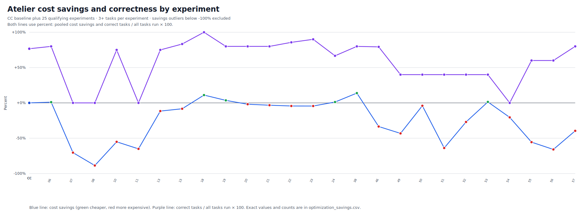

<!-- cspell:ignore Alamofire Excalidraw ast-grep codegraph ctags django jcodemunch nohit okhttp scip serena tokio vscode zoekt -->

<div align="center">

# 🚀 Atelier

### The complete runtime for coding agents

**~64% cheaper · ~70% fewer tokens · ~60% fewer turns**

### [Documentation →](https://atelier.ws)

[](https://github.com/atelier-ws/atelier/releases)
[](https://github.com/atelier-ws/atelier/releases)

[](#supported-platforms)
[](#supported-platforms)

[](https://claude.ai/code)
[](https://openai.com/codex)
[](https://opencode.ai)

<br/>

**Live savings across all Atelier sessions** &nbsp;·&nbsp; updates on every session end

Estimated gross savings: input tokens Atelier kept out of context, priced at each model's input / cache-read rates (zero for unknown models). Net end-to-end cost is measured separately under [Benchmarks](#benchmarks).

[](https://atelier.ws)
[](https://atelier.ws)
[](https://atelier.ws)

</div>

---

## Get Started

### 1. Install

```bash
curl -fsSL https://install.atelier.ws | bash
```

### 2. Initialize your project

```bash
cd your-project
atelier init
```

Already installed? Run `atelier update` to update in place.

---

## Why Atelier?

- **Grounded code intelligence:** search, file reads, exact symbols, call-graph + usages exploration, and outlines.
- **Safer agent edits:** deterministic edit tools plus validation-friendly shell access.
- **Local memory:** repo/session recall without requiring a hosted backend.
- **Host-ready packaging:** MCP configs, agents, and skills for popular coding agents.
- **Cost-aware workflow:** benchmark and savings reports from checked-in artifacts.

---

## MCP Tools

| Tool        | Use                                                                      |
| ----------- | ------------------------------------------------------------------------ |
| `search`    | Semantic + keyword code search across the repo.                          |
| `grep`      | Regex / glob / type-filtered search with token-budgeted output.          |
| `read`      | Budgeted file reads by outline, range, or full file.                     |
| `explore`   | Grouped source + callers, callees, usages — for a concept or one symbol. |
| `codemod`   | Structured, pattern-based code transforms.                               |
| `edit`      | Deterministic file edits with optional verify gate.                      |
| `shell`     | Compact command execution when needed.                                   |
| `memory`    | Local memory read and recall.                                            |
| `sql`       | Query the local index database directly.                                 |
| `web_fetch` | Fetch a public URL and return clean Markdown.                            |

---

## Agents and Skills

Packaged agents in [integrations/agents/](integrations/agents/):

| Agent    | Subagent         | Writes? | Use                                                             | Details                                                                                                                               |
| -------- | ---------------- | ------- | --------------------------------------------------------------- | ------------------------------------------------------------------------------------------------------------------------------------- |
| auto     | atelier:auto     | Yes     | Fully autonomous unattended mode.                               | Runs end to end with no plan approval and no questions. For CI, benchmarks, and headless automation.                                  |
| code     | atelier:code     | Yes     | Main coding mode for edits, refactors, bug fixes, and features. | Uses Atelier MCP tools for file I/O, search, edits, and shell work; applies shared coding guidelines and validates before concluding. |
| explore  | atelier:explore  | No      | Read-only codebase exploration.                                 | Locates files, symbols, and patterns; reports cited findings; never edits, creates, or deletes files.                                 |
| plan     | atelier:plan     | No      | Grounded implementation planning.                               | Explores enough to produce a concrete plan with files, ordering, validation, risks, and open questions; never edits.                  |
| execute  | atelier:execute  | Yes     | Focused execution of an accepted plan or narrow task.           | Makes the smallest code change and stops for review.                                                                                  |
| solve    | atelier:solve    | Yes     | Autonomous end-to-end task solving.                             | Produces the required result early, iterates against real checks, and owns completion.                                                |
| review   | atelier:review   | No      | Adversarial code review.                                        | Reads code directly, reports cited findings, and never edits source files.                                                            |
| research | atelier:research | No      | External research.                                              | Fetches web sources, GitHub repos, and package docs; synthesizes with citations; never edits files.                                   |

Packaged skills in [integrations/skills/](integrations/skills/):

`benchmark` · `orchestrate` · `perf-review` · `recall` · `settings` · `swarms` · `ux-review`

---

## Benchmarks

Atelier vs baseline (Claude Code headless, `claude-sonnet-4-6`) across **7 real-world open-source** codebases — **5 reps** each, median reported. Correctness = mean LLM judge score across reps (0–1). All cost/token figures below are **net, end-to-end measured** (the full cost of each arm) — not the per-tool gross estimate behind the live badges above. Raw results: [reports/public/benchmark/codebench/](reports/public/benchmark/codebench/)

### Exploration tasks

| Codebase            | Prompt                                                           | Language                                        | Turns (atelier / baseline) | Cost              | Tokens          | Time           | Judge score |
| ------------------- | ---------------------------------------------------------------- | ----------------------------------------------- | -------------------------- | ----------------- | --------------- | -------------- | ----------- |
| VS Code             | How does the extension host communicate with the main process?   | TypeScript · 11k files · 3.3M lines · 33M tok   | 6 / 28                     | 82.1% cheaper     | 91.2% fewer     | 28% faster     | 1.00        |
| Excalidraw          | How does Excalidraw render and update canvas elements?           | TypeScript · 600 files · 171k lines · 1.7M tok  | 13 / 28                    | 62.6% cheaper     | 67.1% fewer     | 51% faster     | 0.94        |
| Django              | How does Django's ORM build and execute a query from a QuerySet? | Python · 3k files · 522k lines · 4.8M tok       | 1 / 10                     | 88.1% cheaper     | 92.4% fewer     | 54% faster     | 1.00        |
| Tokio               | How does tokio schedule and run async tasks on its runtime?      | Rust · 784 files · 176k lines · 1.4M tok        | 1 / 14                     | 96.8% cheaper     | 96.9% fewer     | 97% faster     | 0.98        |
| OkHttp              | How does OkHttp process a request through its interceptor chain? | Kotlin/Java · 596 files · 133k lines · 1.1M tok | 1 / 4                      | 84.3% cheaper     | 76.1% fewer     | 14% faster     | 0.98        |
| gin                 | How does gin route requests through its middleware chain?        | Go · 99 files · 24k lines · 171k tok            | 7 / 6                      | 17.8% cheaper     | 17.4% more      | 49% slower     | 0.94        |
| Alamofire           | How does Alamofire build, send, and validate a request?          | Swift · 98 files · 44k lines · 452k tok         | 11 / 17                    | 48.6% cheaper     | 39.5% fewer     | 88% faster     | 1.00        |
| **Overall, pooled** |                                                                  | **7 repos · 16k files · 4.4M lines · 43M tok**  | **205 / 543**              | **72.0% cheaper** | **74.4% fewer** | **71% faster** | **0.98**    |

Run CodeBench:

```bash
atelier benchmark codebench \
  --arm baseline --arm atelier \
  --task cg_all \
  --reps 5 \
  --model claude-sonnet-4-6 \
  --cli-driver claude
```

### SWE benchmark (bug fixing)

End-to-end bug fixing on **[SWE-bench Verified](https://www.swebench.com/)** — a curated **5-instance** slice across **5 Python repos**, **3 reps** each (median reported), `claude-opus-4-8`, run inside each instance's Docker image with official `multi_swe_bench` grading. Both arms run inside the image with the project's conda env activated identically (same setup for both arms). **Resolved** = reps whose patch passes the hidden gold tests. Raw results: [reports/public/benchmark/codebench/swe_verified_3rep/](reports/public/benchmark/codebench/swe_verified_3rep/)

| Instance            | Repo · Language       | Cost              | Tokens          | Turns (atelier / baseline) | Time            | Resolved (atelier / baseline)  |
| ------------------- | --------------------- | ----------------- | --------------- | -------------------------- | --------------- | ------------------------------ |
| sphinx-8120         | Sphinx · Python       | 72.3% cheaper     | 78.5% fewer     | 8 / 28                     | 45.7% faster    | 3/3 / 2/3                      |
| matplotlib-14623    | matplotlib · Python   | 51.2% cheaper     | 67.5% fewer     | 9 / 26                     | 10.0% slower    | 3/3 / 3/3                      |
| scikit-learn-12682  | scikit-learn · Python | 39.3% cheaper     | 51.3% fewer     | 19 / 31                    | 3.2% slower     | 3/3 / 3/3                      |
| django-11138        | Django · Python       | 37.0% cheaper     | 53.3% fewer     | 19 / 35                    | 45.3% slower    | 3/3 / 3/3                      |
| xarray-3305         | xarray · Python       | 31.2% cheaper     | 28.9% fewer     | 12 / 16                    | 24.9% faster    | 3/3 / 3/3                      |
| **Overall, pooled** | **5 instances**       | **45.9% cheaper** | **57.7% fewer** | **67 / 136 (51% less)**    | **3.7% slower** | **15/15 (100%) / 14/15 (93%)** |

#### Optimization and correctness history

Each experiment pools only the tasks run in that experiment. For every included task, it takes the cheapest non-zero baseline rep across the corpus and the cheapest non-zero Atelier rep in that run, then calculates `(sum(baseline) - sum(Atelier)) / sum(baseline) × 100`. The first point, **CC**, is the Claude Code baseline: 0% normalized savings and correctness of `correct tasks / all 30 tasks × 100`. Each Atelier correctness point uses `correct cheapest reps / all tasks run in that experiment × 100`; unreported results are not counted as correct. Negative savings mean Atelier cost more. Experiments with fewer than three tasks, or below −100% savings—where Atelier cost more than 2× the pooled baseline—are excluded. Remaining experiments are ordered by their first captured request time. Exact percentages, task counts, pooled costs, timestamps, and run names: [optimization_savings.csv](reports/public/benchmark/codebench/optimization_savings.csv).



Run the SWE benchmark:

```bash
# Atelier arm uses the lean `atelier:bare` persona.
# Edit-verify and hermetic egress (api.anthropic.com only) are ON by default.
CODEBENCH_ATELIER_AGENT=atelier:bare \
uv run --project benchmarks python -m benchmarks.codebench.multiswe_run \
  --suite swe-bench-verified \
  --instances $(cat benchmarks/codebench/data/verified.txt) \
  --min-changed-files 1 \
  -a baseline atelier \
  --reps 3 \
  --model claude-opus-4-8 \
  --jobs 8
```

Opt out of the defaults with `CODEBENCH_EDIT_VERIFY=0` (disable the edit-verify gate) or widen the egress allowlist with `CODEBENCH_EGRESS_ALLOW=anthropic.com,amazonaws.com,…`.

#### Benchmark Setup

Every knob below is identical for both arms **unless marked (atelier-only)**:**Model:**`claude-opus-4-8`, default sampling, both arms.

- **Environment:** each instance's official SWE-bench Verified Docker image; the repo's conda env activated identically; agent runs as root (`IS_SANDBOX=1`). Both arms run _in-image_.
- **Reps:** 3 per instance, median reported. **Resolved** = reps whose patch passes the hidden gold tests (official `swebench` harness; gold tests are never shown to the agent and gold test files are stripped from the model patch before grading).
- **Turn cap / timeout:** `--max-turns 50`; per-run agent timeout 1800 s.
- **Egress:** hermetic — only `api.anthropic.com` is reachable (no fetching answers, patches, or hints).
- **Disabled tools (both arms):** see Tool parity below.
- **Task set:** SWE-bench Verified instances balanced across repos, each with a substantive baseline cost (≥ $0.50); trivial and non-discriminating instances excluded. **pallets/flask is omitted** — its sole Verified instance is a 3-line change below the substance threshold. List: `benchmarks/codebench/data/verified.txt`.
- **(atelier-only) persona:** `atelier:auto` — lean autonomous persona; it _replaces_ Claude Code's default system prompt (does not stack — see the fixed-cost note).

#### Tool parity (fair comparison)

Both arms run with the **same tools disabled** (`claude --disallowedTools`, applied identically to baseline and Atelier), so neither can stall, ask for help, or fetch the answer:

- **`AskUserQuestion`, `EnterPlanMode`, `ExitPlanMode`** — no stalling on interactive prompts (runs are headless/unattended).
- **`WebFetch`, `WebSearch`** (and Atelier's `mcp__atelier__web_fetch`) — no fetching answers, patches, or hints from the web.
- **`Workflow`, `ScheduleWakeup`** — heavy orchestration tools out of scope for single-instance bug fixing.

These are deferred-loaded (`ToolSearch`), so disabling them costs **neither arm any fixed prompt tokens**.

#### Tool surface & per-tool token counts

Every tool each arm loads, with schema token counts (cl100k proxy, read from the request flows). `Agent` / `Skill` / `ToolSearch` are **identical** Claude Code natives in both arms; heavier tools load on demand via `ToolSearch`.

| Capability        | Vanilla        |       tok | Atelier                |       tok |
| ----------------- | -------------- | --------: | ---------------------- | --------: |
| Shell             | `Bash`         |       724 | `bash`                 |       289 |
| Read file         | `Read`         |       446 | `read`                 |       261 |
| Edit file         | `Edit`         |       255 | `edit`                 |       715 |
| Create file       | `Write`        |       173 | _(folded into `edit`)_ |         — |
| Text/path search  | _(via `Bash`)_ |         — | `grep`                 |       437 |
| Call-graph nav    | —              |         — | `explore`              |       202 |
| Semantic search   | —              |         — | `search`               |       283 |
| Subagents         | `Agent`        |       615 | `Agent`                |       615 |
| Skills            | `Skill`        |       492 | `Skill`                |       492 |
| Deferred-load     | `ToolSearch`   |       376 | `ToolSearch`           |       376 |
| **Tools total**   |                | **3,081** |                        | **3,670** |
| **System prompt** |                | **1,610** |                        |   **996** |
| **Fixed prefix**  |                | **4,691** |                        | **4,666** |

Both keep `Agent`/`Skill`/`ToolSearch`, so both reach the same native deferred pool (TodoWrite, Glob, NotebookEdit, Task, …) on demand.

#### Atelier's fixed cost overhead

Atelier trades a small recurring overhead for fewer, better-grounded turns. Measured on SWE-bench Verified (`claude-opus-4-8`, both arms in-image, read from the captured request flows):

- **The static prompt prefix is ~neutral** (per-tool breakdown in the table above): **~4,691 tok vanilla vs ~4,666 tok Atelier.** Atelier's persona system prompt is _leaner_ than Claude Code's default (996 vs 1,610 tok), offsetting its slightly heavier tool schemas (3,670 vs 3,081). Heavy tools (Workflow, ScheduleWakeup, WebSearch, …) are **deferred** — loaded on demand via `ToolSearch` — so they cost ~0 upfront for either arm.
- **The overhead is conversation content, not the prefix.** The static prefix above is the *tool menu* — paid once and equal for both. The cost is the content Atelier *injects and generates as it works*, which is separate: from turn 1, hooks prepend **~860 tok** of bootstrap / memory / scoped context on top of the (identical) task prompt; over a short session Atelier's richer tool *results* (`explore` call graphs, semantic `search` hits, structured `read`, edit-verify diagnostics) push cached content from ~5.7k to ~9.5k tok — **~3,750 extra**, re-read each turn. On trivial tasks (baseline ≤ $0.15) this *is* essentially the entire Atelier−baseline delta: **~$0.10–0.12 absolute** (+100% relative, trivial in dollars).
- **Per-turn cost ≈ $0.037 vs $0.027 for the baseline** (+$0.010/turn, ~38%) — larger live context and more output per turn.
- **Net:** amortized because Atelier converges in **fewer turns** (median ~17 vs ~27). The fixed floor dominates only on trivial tasks; on substantive tasks the turn reduction wins, producing the savings above. Budget a **~$0.10 floor per task** regardless of size.

### Terminal-Bench

Agentic terminal tasks on **[Terminal-Bench 2.1](https://www.tbench.ai/leaderboard/terminal-bench/2.1)** — the official **89-task** suite, run through the **[Harbor](https://www.harborframework.com/)** harness. The Atelier arm is the `atelier:auto` persona loaded into Claude Code via `--plugin-dir`; both arms run **`claude-opus-4-8`** at **high effort** with **fixed (default) per-task timeouts** and **5 attempts** (`-k 5`) — matching Anthropic's official Opus 4.8 setup (System Card §8.3). The agent runs as root (`IS_SANDBOX=1`) in each throwaway task container, with full trajectories captured (`--output-format stream-json`). Disabled tools: `AskUserQuestion`/`ExitPlanMode` (no stalling on prompts), `WebFetch`/`WebSearch`/`mcp__atelier__web_fetch` (no answer-fetching), `Workflow`/`ScheduleWakeup` (token-heavy).

Auth uses Claude **subscription OAuth tokens** (not API keys), in `benchmarks/harbor/.env`. Each present token gets `ATELIER_BENCH_TOKEN_SLOTS` (default 6) concurrent slots — run `-n 6` with one token, `-n 12` with two:

```bash
# benchmarks/harbor/.env
CLAUDE_CODE_OAUTH_TOKEN_1=sk-ant-oat01-...
# CLAUDE_CODE_OAUTH_TOKEN_2=sk-ant-oat01-...   # optional second subscription
ATELIER_BENCH_MODEL=claude-opus-4-8
```

Build the portable Atelier bundle (pure-Python, old-glibc, reused across every task image), then swap it in:

```bash
docker run --rm -v "$PWD":/atelier:ro -v /tmp/avbuild:/out \
  debian:bullseye-slim bash /atelier/benchmarks/harbor/rebuild_bundle.sh
mv -f /tmp/avbuild/atelier-bundle-new.tar.gz /tmp/avbuild/atelier-bundle.tar.gz
```

Zero-LLM preflight — validates install + code index + the exact `claude` flags on a real task image, **without spending any AI credits**:

```bash
docker run --rm -v "$PWD":/atelier:ro \
  -v /tmp/avbuild/atelier-bundle.tar.gz:/atelier-bundle.tar.gz:ro \
  alexgshaw/adaptive-rejection-sampler:20251031 \
  bash /atelier/benchmarks/harbor/setup_preflight.sh adaptive-rejection-sampler
# -> RESULT:...:PASS node=... cmdprobe=ok idx_git=2 idx_nogit=1 emptyrc=0 logs_agent=ok
```

Run the benchmark — Atelier arm, then the baseline (timeouts stay at the default `1.0` multiplier, per the leaderboard rule):

```bash
set -a; . benchmarks/harbor/.env; set +a
MOUNTS='[{"type":"bind","source":"'"$PWD"'","target":"/atelier","read_only":true},{"type":"bind","source":"/tmp/avbuild/atelier-bundle.tar.gz","target":"/atelier-bundle.tar.gz","read_only":true}]'

# Atelier arm
uv run --no-sync harbor run -d terminal-bench/terminal-bench-2-1 \
  --agent-import-path benchmarks.harbor.atelier_agent:AtelierClaudeCodeHarborAgent \
  --mounts "$MOUNTS" -k 5 -n 6 -o benchmarks/jobs/atelier -y

# Baseline arm — vanilla Claude Code, same model/effort, no Atelier plugin
uv run --no-sync harbor run -d terminal-bench/terminal-bench-2-1 \
  --agent-import-path benchmarks.harbor.atelier_agent:AtelierClaudeCodeHarborAgent \
  --mounts "$MOUNTS" --ak bench_mode=off -k 5 -n 6 -o benchmarks/jobs/baseline -y
```

Resume rate-limited or incomplete trials in place with `harbor job resume -p <job-dir>`.

Run local provider/read benchmarks:

```bash
atelier benchmark providers
```

Provider/read benchmark numbers: triplet is `correctness / median tokens / median ms`; `-` means unsupported or not benchmarked.

| Test type         | [atelier](https://github.com/atelier-ws/atelier) | [atelier-zoekt](https://github.com/sourcegraph/zoekt) | [ast-grep](https://github.com/ast-grep/ast-grep) | [code-index-mcp](https://github.com/johnhuang316/code-index-mcp) | [codegraph](https://github.com/colbymchenry/codegraph) | [jcodemunch-mcp](https://github.com/jgravelle/jcodemunch-mcp) | [scip-python](https://github.com/sourcegraph/scip-python) | [serena](https://github.com/oraios/serena) | [universal-ctags](https://github.com/universal-ctags/ctags) | [zoekt](https://github.com/sourcegraph/zoekt) |
| ----------------- | ------------------------------------------------ | ----------------------------------------------------- | ------------------------------------------------ | ---------------------------------------------------------------- | ------------------------------------------------------ | ------------------------------------------------------------- | --------------------------------------------------------- | ------------------------------------------ | ----------------------------------------------------------- | --------------------------------------------- |
| callees           | **1.00 / 78 / 114**                              | -                                                     | -                                                | -                                                                | 0.85 / 112 / 135                                       | 0.97 / 1654 / 283                                             | -                                                         | -                                          | -                                                           | -                                             |
| callers           | **1.00 / 72 / 48**                               | -                                                     | 0.52 / 276 / 342                                 | -                                                                | 0.99 / 204 / 136                                       | 0.53 / 1666 / 201                                             | 0.13 / 59 / 0.09                                          | 0.86 / 450 / 214                           | -                                                           | -                                             |
| exact_search      | **1.00 / 26 / 53**                               | 0.98 / 73 / 7                                         | -                                                | 0.98 / 247 / 325                                                 | 1.00 / 436 / 132                                       | 1.00 / 162 / 50                                               | -                                                         | 1.00 / 88 / 223                            | -                                                           | 1.00 / 101 / 6                                |
| exact_symbol      | **1.00 / 26 / 11**                               | -                                                     | -                                                | -                                                                | 1.00 / 436 / 137                                       | 1.00 / 431 / 10                                               | 1.00 / 51 / 0.09                                          | 1.00 / 54 / 304                            | 1.00 / 66 / 1                                               | -                                             |
| file_outline      | **1.00 / 126 / 33**                              | -                                                     | -                                                | 0.99 / 975 / 321                                                 | -                                                      | 1.00 / 795 / 5                                                | 1.00 / 183 / 0.09                                         | 0.85 / 51 / 101                            | 1.00 / 687 / 6                                              | -                                             |
| fuzzy_symbol      | 0.99 / 27 / 90                                   | -                                                     | -                                                | -                                                                | -                                                      | **1.00 / 434 / 398**                                          | -                                                         | -                                          | -                                                           | -                                             |
| nohit_search      | 1.00 / 3 / 81                                    | 1.00 / 30 / 7                                         | -                                                | 1.00 / 47 / 308                                                  | **1.00 / 1 / 146**                                     | 1.00 / 61 / 55                                                | -                                                         | **1.00 / 1 / 229**                         | -                                                           | 1.00 / 29 / 6                                 |
| references        | **1.00 / 43 / 22**                               | -                                                     | -                                                | -                                                                | -                                                      | 0.28 / 152 / 7                                                | 0.06 / 52 / 0.09                                          | 0.87 / 651 / 193                           | -                                                           | -                                             |
| structural_search | **0.89 / 31 / 26**                               | -                                                     | 0.15 / 633 / 348                                 | -                                                                | -                                                      | -                                                             | -                                                         | -                                          | -                                                           | -                                             |
| substring_search  | **1.00 / 131 / 76**                              | 0.99 / 292 / 9                                        | -                                                | 0.78 / 862 / 319                                                 | 1.00 / 1012 / 133                                      | 0.81 / 537 / 46                                               | -                                                         | 0.94 / 638 / 227                           | -                                                           | 1.00 / 587 / 8                                |

---

## Docs

- [Installation](docs/installation.md)
- [CLI](docs/cli.md)
- [Host overview](docs/hosts/all-agent-clis.md)
- [MCP SDK](docs/sdk/mcp.md)
- [Troubleshooting](docs/troubleshooting.md)

---

## Star History

<a href="https://star-history.com/#atelier-ws/atelier&Date">
  <picture>
    <source media="(prefers-color-scheme: dark)" srcset="https://api.star-history.com/svg?repos=atelier-ws/atelier&type=Date&theme=dark" />
    <source media="(prefers-color-scheme: light)" srcset="https://api.star-history.com/svg?repos=atelier-ws/atelier&type=Date" />
    
  </picture>
</a>

---

## License

[FSL-1.1-ALv2](LICENSE) — the Functional Source License: source-available and free for any
Permitted Purpose, converting to Apache 2.0 two years after each release. The one carve-out is
a _Competing Use_ (a commercial product or service that competes with Atelier). The
`services/license-issuer/` backend is proprietary and licensed separately under its own `LICENSE`.
